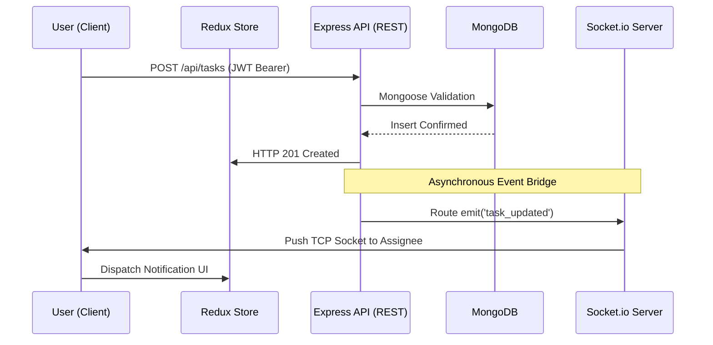

# ⚡ Trackify

<p align="left">
  
  
  
  
</p>

A production-quality, full-stack enterprise dashboard built with the **MERN stack** — featuring real-time WebSocket notifications, role-based access control, interactive Kanban task management, and live analytics charts.

> Built to demonstrate real-world engineering: clean MVC architecture, JWT stateless auth, event-driven sockets, and a polished dark/light mode UI.

---

## 🚀 Live Demo

| Service | URL |
| Frontend    | [https://trackifypm.vercel.app/](https://trackifypm.vercel.app/) |
| Backend API | *Hosted on Render.com* |

**Demo credentials:**
- Admin: create an account then set `role: "admin"` in MongoDB Atlas
- User: register normally — restricted role by default

---

## ✨ Features

### 🏗️ Systems Architecture 
- **Event-Driven WebSockets:** Decouples REST HTTP state from push notifications natively, providing sub-millisecond sync.
- **Client-Side Canvas Compression:** Avatars are dynamically scaled and compressed via HTML5 `<canvas>` directly in the browser before Base64 serialization, saving immense database bandwidth.
- **OWASP Hardened:** Passively bulletproofed against NoSQL Injections (`express-mongo-sanitize`), XSS (`helmet`), and mass-assignment payload manipulation.

### 🔐 Authentication & Security
- JWT-based stateless authentication (7-day expiry)
- `bcryptjs` password hashing with salt rounds
- Protected routes — enforced on both frontend *and* backend
- Role-Based Access Control (Admin vs User)
- `helmet` for secure HTTP headers
- `express-rate-limit` — 120 req/15min global, 15 req/15min on auth routes
- `express-mongo-sanitize` — NoSQL injection prevention
- Mass-assignment protection on all update endpoints
- Request body size capped at 10 KB

### 📋 Task Management
- Full CRUD — create, edit, delete tasks
- **Kanban board** with drag-and-drop (`@hello-pangea/dnd`)
- **List view** toggle
- Filter by status and priority
- Due date tracking with overdue highlighting
- Admins can assign tasks to any user
- Assignees can view and update their own tasks

### 🔔 Real-Time Notifications
- `socket.io` WebSocket server with per-user private rooms
- Live push notifications when a task is assigned or updated
- Bell icon with unread count badge
- Notification dropdown (click-outside to dismiss)
- Toast alerts via `react-hot-toast`

### 📊 Analytics Dashboard
- **Admin view:** Total users, tasks by status, 6-month area chart (task activity), 6-month bar chart (new users), global activity log, CSV export
- **User view:** Personal task stats, completion rate progress bar
- Trend percentages (month-over-month)

### 👤 User Management (Admin)
- Paginated user table with search
- Inline role editing
- Confirm-before-delete dialog (no accidental wipes)
- Self-deletion blocked

### 🎨 UI & UX
- Dark / Light mode toggle (persisted)
- Inter font, CSS custom properties design system
- Glassmorphism, smooth gradients, micro-animations
- Command palette (`Cmd+K`) for quick task search
- Responsive — mobile sidebar with slide-in animation
- Avatar upload from local file (canvas-compressed) or URL
- Clicking avatar anywhere → jumps to Profile

---

## 🏗️ Technical Architecture

The platform architecture follows the MVC pattern on the backend, seamlessly feeding into a Redux-governed React application.



### 🗄️ Database Schema Design

Trackify runs on a multi-collection NoSQL topology within **MongoDB Atlas**. The schema actively leverages native `.populate()` pipelines to reduce API call round-trips algorithmically.

```javascript
// Relational reference demonstration inside standard Document formulation:
const TaskSchema = new mongoose.Schema({
  title:       { type: String, required: true, maxlength: 200 },
  status:      { type: String, enum: ['todo', 'in-progress', 'done'] },
  assignedTo:  { type: mongoose.Schema.Types.ObjectId, ref: 'User' },
  createdBy:   { type: mongoose.Schema.Types.ObjectId, ref: 'User', required: true }
}, { timestamps: true });
```

---

## 🛠️ Tech Stack

| Layer | Technology |
|-------|-----------|
| Frontend | React 19, Vite, Redux Toolkit |
| Styling | Vanilla CSS (custom design system) |
| Charts | Recharts |
| Drag & Drop | @hello-pangea/dnd |
| Backend | Node.js, Express 5 |
| Database | MongoDB, Mongoose |
| Auth | JWT, bcryptjs |
| Real-time | Socket.io |
| Security | Helmet, express-rate-limit, mongo-sanitize |

---

## 📁 Project Structure

```
resume-project/
├── client/                  # React + Vite frontend
│   ├── public/
│   │   └── favicon.svg
│   └── src/
│       ├── api/             # Axios instance with interceptors
│       ├── app/             # Redux store
│       ├── components/      # Navbar, Sidebar, StatCard, etc.
│       ├── features/        # Redux slices (auth, tasks, users, notifications)
│       ├── layouts/         # MainLayout (socket connection lives here)
│       └── pages/           # Dashboard, Tasks, Users, Profile, Login, Signup
│
└── server/                  # Express + Socket.io backend
    ├── config/              # MongoDB connection
    ├── controllers/         # Business logic
    ├── middleware/          # Auth, role, error handlers
    ├── models/              # Mongoose schemas (User, Task)
    ├── routes/              # Express routers
    ├── utils/               # generateToken
    └── server.js            # Entry point
```

---

## ⚙️ Local Development

### Prerequisites
- Node.js 18+
- MongoDB Atlas account (or local MongoDB)

### 1. Clone the repo
```bash
git clone https://github.com/PreetMongaPM/Trackify.git
cd Trackify
```

### 2. Configure the backend
```bash
cd server
cp .env.example .env   # then fill in your values
npm install
npm run dev            # starts on http://localhost:5000
```

**`server/.env`**
```env
MONGO_URI=mongodb+srv://<user>:<pass>@cluster.mongodb.net/saasdb
JWT_SECRET=your_super_secret_key_here
JWT_EXPIRE=7d
CLIENT_URL=http://localhost:5173
PORT=5000
NODE_ENV=development
```

### 3. Configure the frontend
```bash
cd client
cp .env.example .env.local   # optional — Vite proxies /api by default
npm install
npm run dev                  # starts on http://localhost:5173
```

The Vite dev server proxies `/api` → `http://localhost:5000`, so no CORS config needed locally.

---

## 🌐 Deployment

### Backend → Render

1. Push your repo to GitHub
2. Go to [render.com](https://render.com) → **New Web Service**
3. Connect your GitHub repo, select the `server/` directory
4. Set:
   - **Build command:** `npm install`
   - **Start command:** `npm start`
5. Add your environment variables in Render's dashboard (same as `.env` above, but set `NODE_ENV=production` and `CLIENT_URL=https://your-vercel-app.vercel.app`)
6. Copy your Render service URL (e.g. `https://saas-api.onrender.com`)

### Frontend → Vercel

1. Go to [vercel.com](https://vercel.com) → **New Project**
2. Import your GitHub repo, select the `client/` directory as root
3. Add environment variable:
   ```
   VITE_API_BASE_URL=https://saas-api.onrender.com/api
   ```
4. Deploy. Vercel auto-detects Vite.

> **After deploying both:** Go back to Render and update `CLIENT_URL` to your Vercel URL. This keeps CORS and Socket.io locked down.

### Final check
- Visit your Vercel URL and create an account
- In MongoDB Atlas → browse your `users` collection → change your user's `role` to `"admin"`
- Log back in — you now have full admin access

---

## 🔑 API Reference

| Method | Endpoint | Auth | Description |
|--------|----------|------|-------------|
| POST | `/api/auth/signup` | Public | Register |
| POST | `/api/auth/login` | Public | Login |
| GET | `/api/auth/me` | JWT | Current user |
| GET | `/api/tasks` | JWT | Get tasks (filtered by role) |
| POST | `/api/tasks` | JWT | Create task |
| PUT | `/api/tasks/:id` | JWT | Update task (owner/assignee/admin) |
| DELETE | `/api/tasks/:id` | JWT | Delete task (owner/admin) |
| GET | `/api/users` | Admin | List all users |
| PUT | `/api/users/:id` | Admin | Update user role |
| DELETE | `/api/users/:id` | Admin | Delete user |
| PUT | `/api/users/profile` | JWT | Update own profile |
| GET | `/api/analytics` | Admin | Platform analytics |
| GET | `/api/analytics/me` | JWT | Personal stats |

---

## 📄 License

MIT — free to use and modify.

---

<p align="center">Built with ⚡ by <strong>Preet Monga</strong></p>
